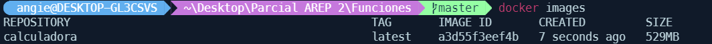
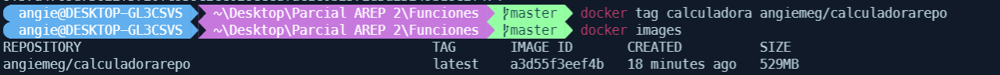
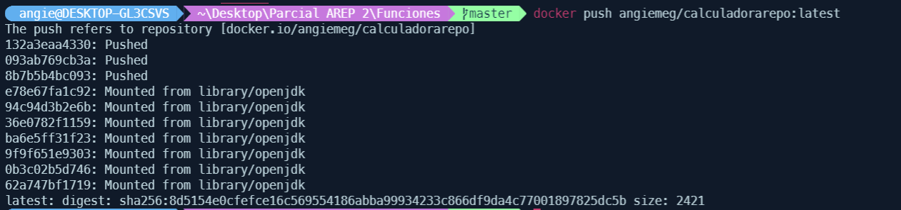
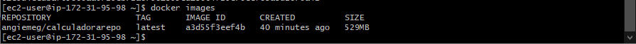

# PARCIAL 2 AREP
Se diseñó, construyó y despliegó los siguientes servicios en un microcontenedor docker desplegado en una instancei a EC2 de AWS. Se seleccionaron las funciones matemáticas de **arcotangente** y **logaritmo natural**.Las funciones reciben un solo parámetro de tipo "Double" y retornan una prámetro sde tipo "Double".
## Comenzando 🚀

A continuación se presentarán series de instrucciones para que se pueda tener un funcionamiento en maquina local del proyecto


### Pre-requisitos 📋

Para el correcto funcionamiento en un ambiente de desarrollo se deberán tener instaladas las siguientes tecnologías:  
* [Git](https://git-scm.com/) - Software de control de versiones
* [Java 8](https://www.java.com/es/download/ie_manual.jsp) - Entorno de desarrollo
* [Maven](https://maven.apache.org/) - Manejador de dependencias
* [Spark](https://sparkjava.com/download) - Micro framework para el desarrollo de aplicaciones web en Java

### Instalación 🔧

1. **Clonar el proyecto**
    ```
    git clone https://github.com/AngieMeG/AREP-P2.git
    ```
2. **Compilar el proyecto**
    ```
    mvn package
    ```
3. **Ejecutar la aplicación**  
    * Para entornos Windows
        ```
        java -cp "target/classes;target/dependency/*"  edu.escuelaing.arep.App
        ``` 
    * Para entornos Unix
        ```
        java $JAVA_OPTS -cp target/classes:target/dependency/*  edu.escuelaing.arep.App
        ```
4. **Servicio Web**  
Para realizar las solicitudes GET de las funciones matemáticas
    ```
    http://localhost:4567/atan?value=**numero**
    ```
    ```
    http://localhost:4567/In?value=**numero**
    ```
## Ejecutando las pruebas ⚙️

Para la ejecución de las pruebas
```
mvn test
```


# Despliegue 📦
Para el despliegue, en una primera instancia se deberá crear un archivo Dockerfile y montar una imagen en Docker con el comando
```
docker build --tag calculadora .
```  

A partir de esta imagen se crea un contenedor con el comando  
```
docker run -d -p 34000:6000 --name calculadoraContainer calculadora
```  


Se sube a DockerHub haciendo una referencia al contenedor previamente creado  


Se sube el contenedor al repositorio en DockerHub
```  
docker push angiemegil/calculadorarepo:latest
```  


La muestra de la ejecución local con Docker se muestra [AQUI](https://youtu.be/ObJhpPPVko8)

Para realizar el proceso en AWS, se deberá crear una instancia EC2, generar las llaves, cambiar los permisos e iniciar sesión en la maquina desde consola.  
Una vez conectado a la maquina s debera installar dockerHub
```  
sudo yum install docker
```  
Se inicia el servicio de docker
```  
sudo service docker start
```  
Configure su usuario en el grupo de docker para no tener que ingresar “sudo” cada vez que invoca un comando
```  
sudo usermod -a -G docker ec2-user
```
Desconectes de la máquina virtual e ingrese nuevamente para que la configuración de grupos de usuarios tenga efecto.  

A partir de la imagen creada en Dockerhub cree una instancia de un contenedor docker independiente de la consola (opción “-d”) y con el puerto 6000 enlazado a un puerto físico de su máquina (opción -p):
```
docker run -d -p 42000:6000 --name calculadoraimageaws angiemegil/calculadorarepo
```



La muestra de la ejecución de la maquina EC2 de AWS se muestra [AQUI](https://youtu.be/wQlBuBk_9pw)

## Construido con 🛠️

* [Maven](https://maven.apache.org/) - Manejador de dependencias
* [Docker] (https://www.docker.com/) - Es un proyecto de código abierto que automatiza el despliegue de aplicaciones dentro de contenedores de software, proporcionando una capa adicional de abstracción y automatización de virtualización de aplicaciones en múltiples sistemas operativos
* [JUnit](https://junit.org/junit5/) - Herramienta para pruebas unitarias en Java
* [AWS](https://aws.amazon.com/es/) - Amazon Web Services es una colección de servicios de computación en la nube pública que en conjunto forman una plataforma de computación en la nube, ofrecidas a través de Internet por Amazon.com
* [EC2](https://aws.amazon.com/es/ec2/?ec2-whats-new.sort-by=item.additionalFields.postDateTime&ec2-whats-new.sort-order=desc) - Amazon Elastic Compute Cloud (Amazon EC2) es un servicio web que proporciona capacidad informática en la nube segura y de tamaño modificable. Está diseñado para simplificar el uso de la informática en la nube a escala web para los desarrolladores

## Documentación 📖
Para generar la documentación
```
mvn javadoc:javadoc
```

Haga click [AQUI](./Documentacion/apidocs/index.html) para ver la documentación

## Autores ✒️

* **Angie Tatiana Medina Gil**

## Licencia 📄

Este proyecto está bajo la Licencia GNU General Public License mire el archivo [LICENSE.md](LICENSE.md) para detalles